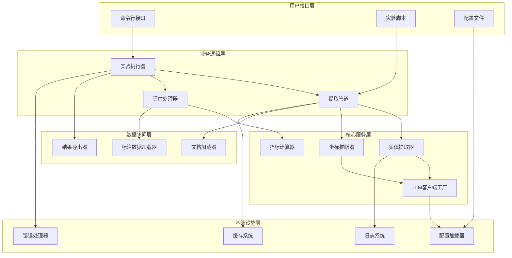
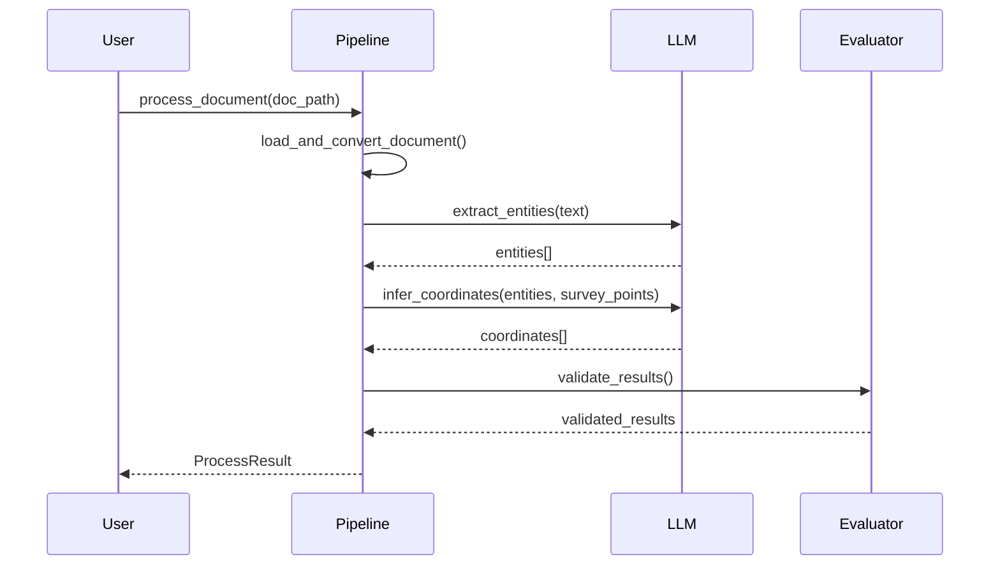
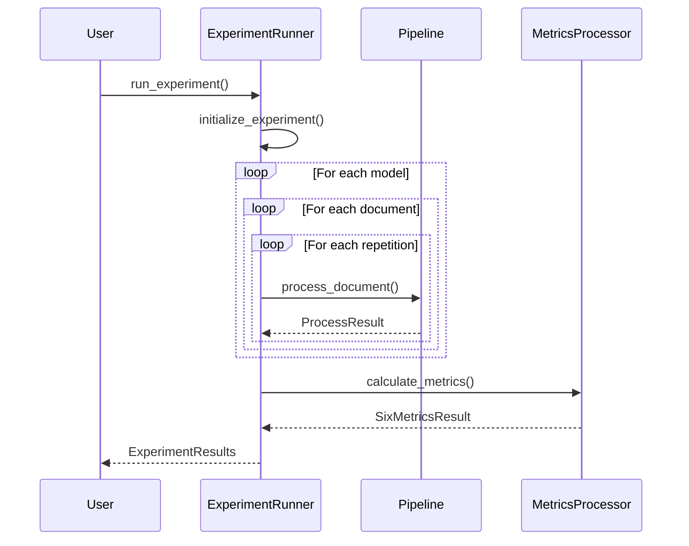

# 系统架构概述

本文档详细介绍KG钻孔实体提取系统的整体架构设计和核心组件。

## 🏗️ 系统概述

KG钻孔实体提取系统是一个基于大语言模型的地质数据提取和分析平台，采用模块化架构设计，支持多模型并行处理和批量实验执行。

### 核心特性
- **多LLM模型支持**: 集成10+种主流LLM模型
- **智能坐标推断**: 基于自然语言的空间位置推理
- **6指标评估体系**: 全面的质量评估框架
- **模块化架构**: 松耦合、可扩展的设计
- **并行处理**: 支持多线程和异步处理
- **配置驱动**: 灵活的配置管理系统

## 🏛️ 整体架构



## 📦 核心模块

### 1. 核心数据模型 (`core/models.py`)

**功能**: 定义系统中的核心数据结构

```python
# 主要类
class DrillHoleEntity:          # 钻孔实体
class CoordinateInfo:           # 坐标信息
class ProcessResult:            # 处理结果
class SixMetricsResult:         # 6指标评估结果
class LLMModel:                # LLM模型枚举
```

**设计特点**:
- 使用dataclass减少样板代码
- 支持JSON序列化和反序列化
- 内建数据验证和类型检查

### 2. 配置管理系统 (`core/config.py`)

**功能**: 线程安全的配置加载和管理

```python
class ConfigLoader(metaclass=ConfigLoaderMeta):
    - 单例模式实现
    - 热更新支持
    - 环境变量替换
    - 嵌套配置访问
```

**配置层级**:
1. 环境变量 (最高优先级)
2. 专门配置文件 (`configs/*.yaml`)
3. 主配置文件 (`configs/config.yaml`)
4. 系统默认值

### 3. LLM集成层 (`llm/`)

**架构**: 工厂模式 + 策略模式

```python
# 工厂类
class LLMClientFactory:
    - create_client(model: LLMModel) -> BaseLLMClient
    - 支持多种LLM提供商

# 提供商实现
class OpenRouterClient(BaseLLMClient)    # OpenRouter
class DeepSeekClient(BaseLLMClient)      # DeepSeek官方
class AliyunClient(BaseLLMClient)        # 阿里云百炼
```

**支持的模型**:
- **DeepSeek系列**: R1, V3, R1-Distill变体
- **Qwen系列**: Qwen-Max, Qwen3-32B, QwQ-32B
- **OpenAI系列**: GPT-3.5, GPT-4o-mini (通过OpenRouter)

### 4. 提取管道 (`extraction/`)

**核心组件**:

```python
class ExtractionPipeline:
    """主要处理流程"""
    1. 文档加载和预处理
    2. 实体提取 (LLM调用)
    3. 坐标推断 (空间推理)
    4. 结果后处理和验证
```

**处理流程**:
```
Word文档 → Markdown转换 → 文本分块 → LLM提取 → 实体验证
    ↓
坐标推断 ← 测量点数据 ← 位置描述分析 ← 自然语言处理
    ↓
结果聚合 → 质量检查 → ProcessResult输出
```

### 5. 评估系统 (`evaluation/`)

**6指标评估框架**:

| 指标 | 描述 | 计算方法 |
|-----|------|---------|
| extraction_recall | 实体提取召回率 | 提取数量/标注数量 |
| location_recall | 位置描述提取率 | 有位置描述的实体比例 |
| coordinate_success_rate | 坐标推断成功率 | 成功推断的坐标比例 |
| processing_stability | 处理稳定性 | 多轮结果的一致性 |
| efficiency_coefficient | 效率系数 | token使用效率 |
| avg_location_processing_time | 平均处理时间 | 单个文档平均处理时长 |

### 6. 实验执行器 (`experiment/`)

**功能**: 批量实验的orchestration和管理

```python
class ExperimentRunner:
    """实验执行管理器"""
    - 多模型并行处理
    - 错误恢复和重试
    - 进度跟踪和监控
    - 结果聚合和导出
```

**实验类型**:
- **快速测试**: 3文档×1轮，功能验证
- **标准测试**: 10文档×3轮，质量评估  
- **完整测试**: 30文档×3轮，性能基准
- **自定义测试**: 用户定义参数

## 🔄 数据流

### 1. 单文档处理流程



### 2. 批量实验流程



## 🎯 设计原则

### 1. 单一职责原则
每个模块都有明确的职责边界：
- **配置管理**: 只负责配置的加载和访问
- **LLM客户端**: 只负责与LLM API的交互
- **提取管道**: 只负责单个文档的处理流程
- **实验执行器**: 只负责批量实验的调度管理

### 2. 依赖注入
通过构造函数注入依赖，提高testability：
```python
class ExtractionPipeline:
    def __init__(
        self,
        model: LLMModel,
        config_loader: ConfigLoader = None,  # 可注入
        llm_client: BaseLLMClient = None     # 可注入
    ):
```

### 3. 工厂模式
LLM客户端创建使用工厂模式，支持新模型扩展：
```python
class LLMClientFactory:
    @staticmethod
    def create_client(model: LLMModel) -> BaseLLMClient:
        # 根据模型类型创建对应客户端
```

### 4. 策略模式
不同的LLM提供商实现相同的接口：
```python
class BaseLLMClient(ABC):
    @abstractmethod
    async def chat_completion(self, messages: List[Dict]) -> str:
```

## 🔧 扩展性设计

### 1. 新增LLM模型
1. 在 `LLMModel` 枚举中添加新模型
2. 实现对应的 `BaseLLMClient` 子类
3. 在 `LLMClientFactory` 中注册新客户端
4. 添加配置文件中的模型配置

### 2. 新增评估指标
1. 在 `SixMetricsResult` 中添加新字段
2. 在 `SixMetricsProcessor` 中实现计算逻辑
3. 更新输出格式配置

### 3. 新增导出格式
1. 继承 `BaseExporter` 实现新导出器
2. 在配置文件中添加格式配置
3. 在 `ExperimentRunner` 中集成新导出器

## 📊 性能特性

### 1. 并发处理
- **多线程处理**: 支持多文档并行处理
- **异步LLM调用**: 减少IO等待时间
- **连接池管理**: 复用HTTP连接

### 2. 缓存机制
- **LLM响应缓存**: 相同输入复用结果
- **文档内容缓存**: 避免重复读取
- **配置热更新**: 无需重启应用

### 3. 内存管理
- **流式处理**: 大文档分块处理
- **垃圾回收**: 主动释放不再使用的对象
- **内存监控**: 实时监控内存使用情况

## 🛡️ 容错设计

### 1. 错误分类
- **临时错误**: 网络超时、限流等 → 自动重试
- **永久错误**: 认证失败、配额用尽等 → 快速失败
- **部分错误**: 单个文档失败 → 继续处理其他文档

### 2. 重试策略
```python
@retry(
    stop=stop_after_attempt(3),
    wait=wait_exponential(multiplier=1, min=1, max=10)
)
def llm_call(...):
```

### 3. 降级处理
- **模型降级**: 主模型失败时使用备用模型
- **功能降级**: 坐标推断失败时跳过该步骤
- **数据降级**: 提供部分结果而不是完全失败

---

📖 **相关文档**:
- [模块详细设计](./module_design.md) - 各模块的详细设计文档
- [数据流分析](./data_flow.md) - 深入的数据流分析
- [性能优化指南](../developer/performance_optimization.md) - 系统性能优化建议